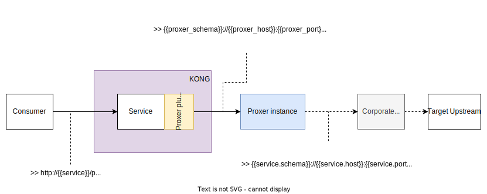

# kong-proxer

Kong **3.x** plugin which forwards requests to a [proxer instance](https://github.com/fenix-hub/proxer) (liteweight Go proxy wrapper) before hitting the target service host.  
You can find the forward proxy here 👉 [proxer](https://github.com/fenix-hub/proxer)



## Configuration
- `proxer_schema` : default schema to use when forwarding to *proxer*. If left empty, the schema of the upstream request will be used.
- `proxer_host` : *proxer* host, can be a domain or server IP
- `proxer_port` : *proxer* port, `80` by default
- `proxer_ssl_port` : *proxer* port when schema is `https`. `443` by default
- `proxer_schema_header` : custom header name required by *proxer* in order to know what scheme should be used for the request host. `X-ProxyTo-Schema` default value as used by *proxer*
- `proxer_host_header` : custom header name required by *proxer* in order to know the target request host. `X-ProxyTo-Host` default value as used by *proxer*

```bash
$ curl -X POST http://kong:8001/plugins \
    --data "name=proxer" \
    --data "config.proxer_schema=http" \
    --data "config.proxer_host=proxer-instance" \
    --data "config.proxer_port=8080" \
    --data "config.proxer_ssl_port=8081" \
    --data "config.proxer_schema_header=X-ProxyTo-Schema" \
    --data "config.proxer_host_header=X-ProxyTo-Host"
```

## Installation

### Manual
Clone the repository, navigate to the root folder and run:
```
make install
```

Edit your ```kong.yaml``` to include the plugin like so:
```yaml
custom_plugins:
  - proxer
```

Restart Kong.

### Laurocks

You can run `luarocks install kong-proxer` in your kong instance.  
Remember to enable the plugin.
